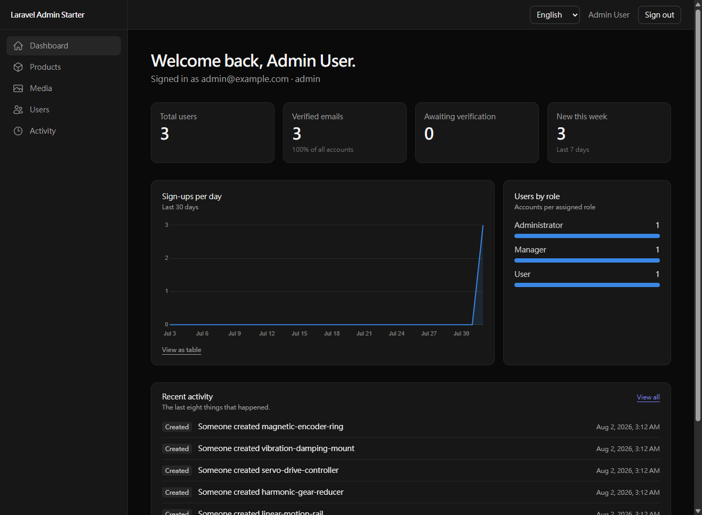
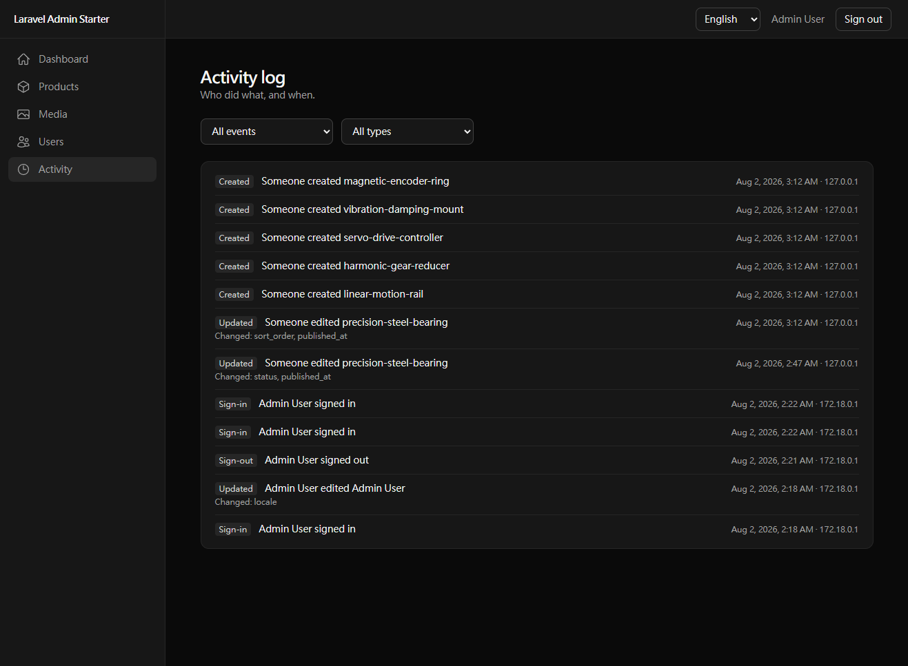
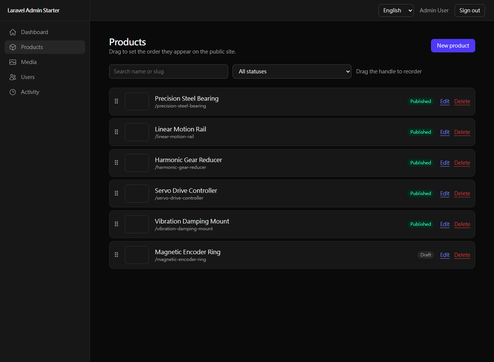
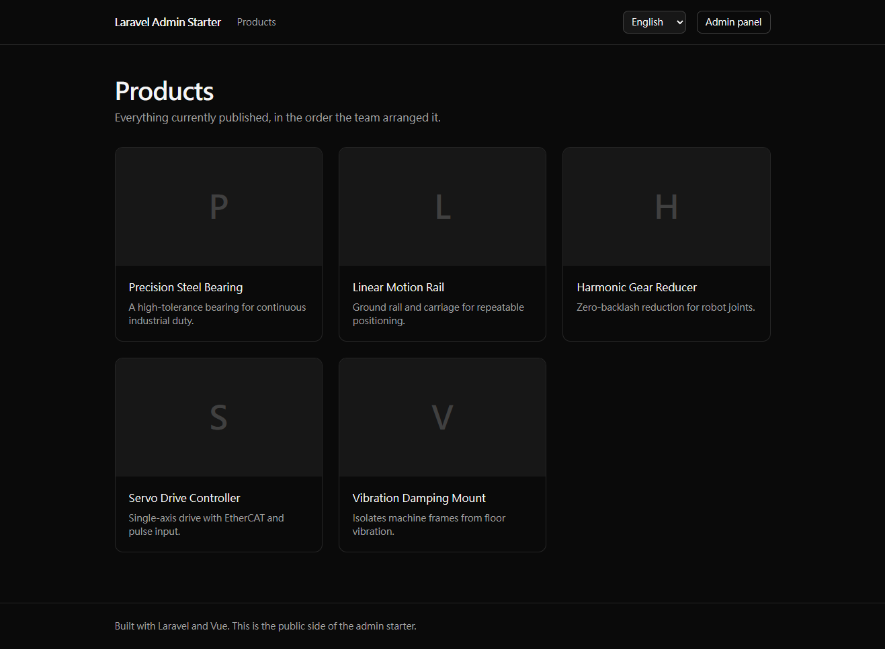

# Laravel Admin Starter

An open-source admin panel and public website built on Laravel 13 and Vue 3, with role-based
access control, a bilingual interface, a WYSIWYG product catalogue, a media library and an audit
log. Everything runs in Docker; nothing but Docker Desktop has to be installed on the host.

**繁體中文說明:[README.zh-TW.md](README.zh-TW.md)**

The admin panel lives under `/admin`. The root is a public website that reads the same catalogue,
so a change made in the panel is visible to a visitor immediately — the point being that this is a
system that runs, not a set of management forms.

| | |
| --- | --- |
|  |  |
| Dashboard — stats, sign-up trend, recent activity | Activity log — who did what, and when |
|  |  |
| Products — drag to set the public order | The public site, driven by that order |

## What is in it

- **Authentication** — register, sign in, sign out, forgot and reset password, email verification.
  Sanctum in SPA cookie mode, so no token is stored in the browser.
- **RBAC** — roles and permissions as many-to-many tables, a `Gate::before` admin bypass, route
  middleware for "may you touch this feature" and policies for "may you touch this record".
- **Dashboard** — totals, a 30-day sign-up trend (Chart.js), the role split, and recent activity.
- **User management** — search, role and verification filters, sorting, pagination, and a guard
  that stops a manager from promoting themselves to administrator.
- **Bilingual UI** — English and Traditional Chinese across the SPA *and* the API, so validation
  errors arrive in the language the interface is using. Preference follows the account.
- **Product catalogue** — TipTap rich text sanitised on write, per-language content, cover images,
  draft/published, and drag-and-drop ordering that the public site obeys.
- **Media library** — drag-and-drop upload, preview, delete, and a picker wired into the editor's
  image button.
- **Activity log** — sign-ins, failed sign-ins and content changes, with entries that stay readable
  after the account or record they refer to has been deleted.
- **Public website** — product list and detail pages, no sign-in required, published products only.

141 tests, all passing.

## Stack

| Layer | Technology |
| --- | --- |
| Backend | Laravel 13, PHP 8.4 |
| Auth | Laravel Sanctum (SPA / cookie mode) |
| Frontend | Vue 3, Vue Router, Pinia, Vite 8, Tailwind CSS 4 |
| Editor | TipTap 3 (ProseMirror) |
| Sanitisation | symfony/html-sanitizer |
| Charts | Chart.js 4 |
| i18n | vue-i18n 11 + Laravel lang files |
| Database | MySQL 8.4 |
| Cache / queue | Redis 7 |
| Web server | Nginx |
| Containers | Docker Compose |

## Getting started

Requires [Docker Desktop](https://www.docker.com/products/docker-desktop/). PHP, Node, MySQL and
Redis all run in containers.

```bash
git clone https://github.com/<your-account>/laravel-admin-starter.git
cd laravel-admin-starter

cp .env.example .env

docker compose up -d --build

docker compose exec php php artisan key:generate
docker compose exec php php artisan migrate --seed
docker compose exec php php artisan storage:link
```

Then open <http://localhost:8080> for the public site and <http://localhost:8080/admin> for the
panel.

### Demo accounts

Created by `artisan db:seed`, together with a small sample catalogue. All three share the password
`password`.

| Email | Role | Can do |
| --- | --- | --- |
| `admin@example.com` | Administrator | Everything, including the activity log |
| `manager@example.com` | Manager | Products, media, and viewing/creating/updating users |
| `user@example.com` | User | Their own profile only |

Sign in as the manager to see RBAC working from the other side: no activity log in the sidebar, no
delete button on users, and the API refusing the same things the interface is hiding.

The seeded catalogue leaves one product as a draft. It appears in the panel and not on the public
site, which is the quickest way to confirm the publishing rule is real.

### Services

| Service | URL |
| --- | --- |
| Application | <http://localhost:8080> |
| Vite dev server | <http://localhost:5173> |
| MySQL | `localhost:3306` (`laravel` / `secret`) |
| Redis | `localhost:6379` |

Change the published ports with `APP_PORT`, `VITE_PORT`, `FORWARD_DB_PORT` and
`FORWARD_REDIS_PORT` in `.env` if any of them are already taken.

### Common commands

```bash
docker compose exec php php artisan migrate:fresh --seed   # reset the database
docker compose exec php php artisan test                   # run the test suite
docker compose exec php php vendor/bin/pint                # format PHP
docker compose exec node npm run build                     # production front-end build
docker compose logs -f node                                # follow the Vite dev server
docker compose down -v                                     # stop and drop volumes
```

## How it is put together

```text
app/
  Http/Controllers/          admin API, plus PublicProductController for the website
  Http/Resources/            what each audience is allowed to see
  Models/Concerns/           HasRoles, LogsActivity
  Policies/                  per-record authorisation
  Support/                   RichText (HTML sanitiser), ActivityRecorder, Locales
resources/js/
  layouts/                   AppLayout (admin sidebar), PublicLayout (website)
  pages/                     one directory per section, plus pages/public/
  stores/auth.js             session, permissions, locale
docs/
  ROADMAP.md                 feature tracker and engineering notes
  ROADMAP.zh-TW.md           the same, in Traditional Chinese
```

A few decisions worth knowing before you change something. The reasoning behind each, and about
thirty more, is in [docs/ROADMAP.md](docs/ROADMAP.md).

- **HTML is sanitised on write, not on output.** The database only ever holds safe HTML, so a
  template that forgets to escape cannot resurrect the hole. It is why the public site can render
  editor output with `v-html`.
- **`Gate::before` grants admins everything except on their own account.** Otherwise rules like
  "nobody may delete themselves" never run for the one account they matter most for.
- **Authorisation runs before validation** (`can:` middleware via `HasMiddleware`), so an
  unauthorised caller gets a 403 rather than a 422 describing fields they should not know about.
- **Public resources are allow-lists.** A column added later is invisible on the website until
  somebody decides otherwise.
- **A draft returns 404, not 403.** A 403 would confirm the product exists.
- **Polymorphic columns store short aliases**, not `App\Models\Product`, so classes can be renamed
  without breaking history that has already been written.

## Testing

```bash
docker compose exec php php artisan test
```

The suite runs against an in-memory SQLite database and covers authorisation boundaries rather
than only happy paths: privilege escalation, self-deletion, drafts leaking past filters, passwords
reaching the activity log, and SVG reaching the media library.

Two bugs in this project were caught by opening a browser after the tests were green — both are
written up in the roadmap, because the lesson generalises.

## Known limitations

- **No server-side rendering.** `usePageMeta` sets the title and meta description, which works for
  browsers and for crawlers that execute JavaScript. A crawler that does not still sees an empty
  shell. Real SEO for the public site would need SSR or prerendering.
- **No raw HTML editing yet.** A WordPress-style "Text" view is designed but not built; the plan
  (a `products.publish_html` permission with a second, server-defined allow-list) is in the
  roadmap.
- **Queues run synchronously.** Redis is wired up but mail and other jobs still run in-process;
  switch `QUEUE_CONNECTION` and add a worker container if you need otherwise.
- **The Vite dev server polls for changes.** Required on Windows and macOS, where bind mounts do
  not deliver inotify events into the container. Harmless, but it costs some CPU.

## Contributing

Issues and pull requests are welcome. See [CONTRIBUTING.md](CONTRIBUTING.md) for how to run the
checks locally and what a useful pull request looks like here.

## License

[MIT](LICENSE)
